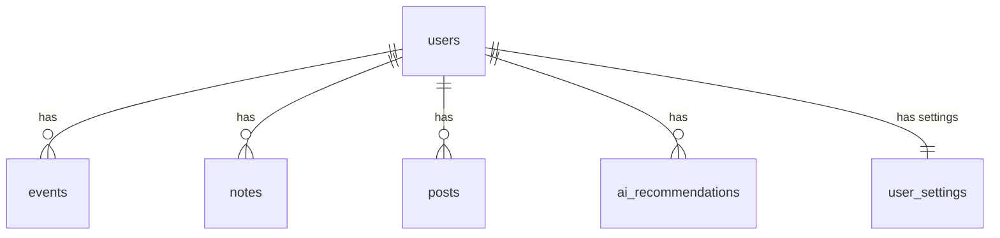
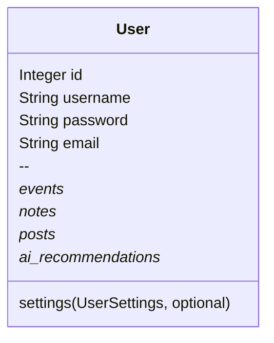
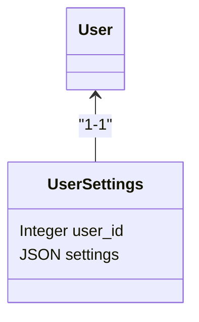
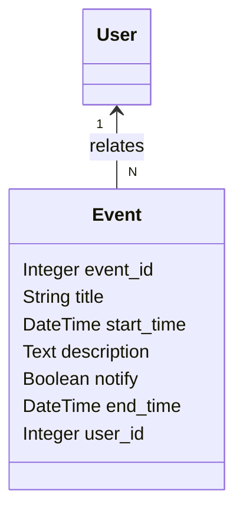
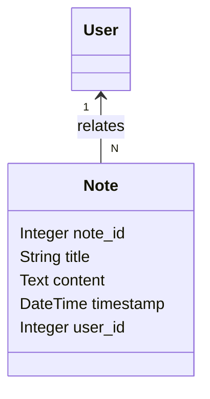
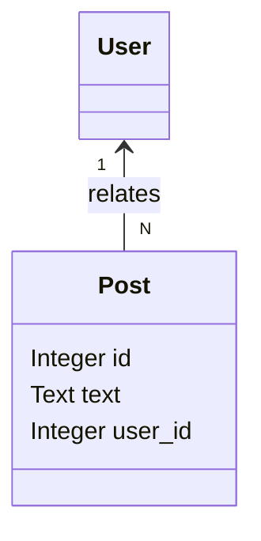
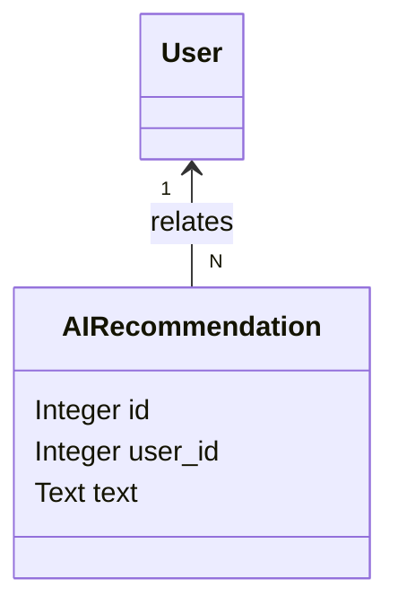
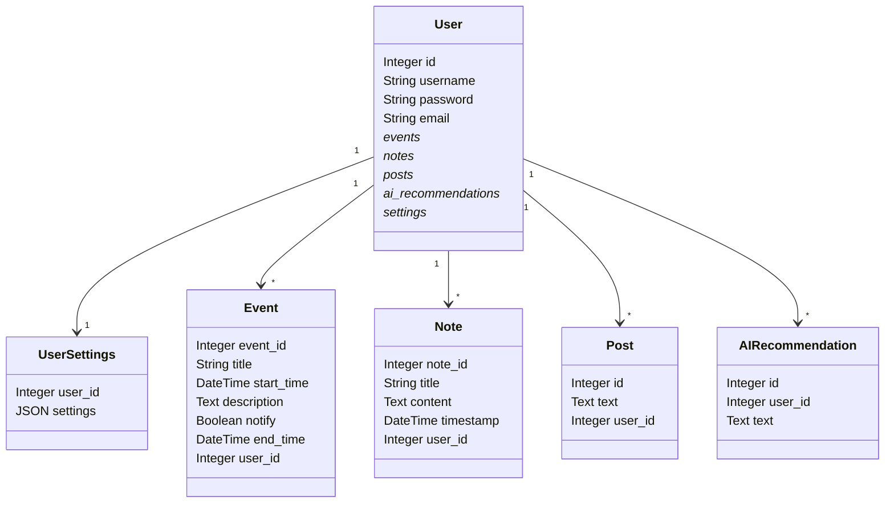
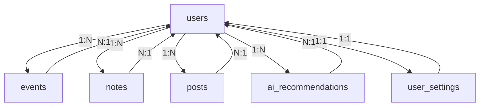

# Dashboard API Adatbázis Dokumentáció

Ez a dokumentáció részletesen bemutatja a WebAssistant API backend mögött álló adatbázis-sémát, a táblák szerkezetét, a kapcsolatok típusait, és a legfontosabb lekérdezéseket. A modelleket, mezőket, relációkat és példákat külön szekciókban ábrákkal illusztráljuk.

---

## Tartalomjegyzék

- [Adatbázis modell összefoglaló](#adatbázis-modell-összefoglaló)
- [Relációs diagram (ERD)](#relációs-diagram-erd)
- [Táblák részletei](#táblák-részletei)
  - [Felhasználók (`users`)](#felhasználók-users)
  - [Felhasználó beállítások (`user_settings`)](#felhasználó-beállítások-user_settings)
  - [Események (`events`)](#események-events)
  - [Jegyzetek (`notes`)](#jegyzetek-notes)
  - [Posztok (`posts`)](#posztok-posts)
  - [AI Ajánlások (`ai_recommendations`)](#ai-ajánlások-ai_recommendations)
- [Példák: SQL DDL generálás](#példák-sql-ddl-generálás)
- [Fontos lekérdezések és minták](#fontos-lekérdezések-és-minták)
- [Ábrák](#ábrák)
  - [Egyszerű ERD](#egyszerű-erd)
  - [Táblák attribútumdiagramjai](#táblák-attribútumdiagramjai)
  - [Kapcsolati mátrix](#kapcsolati-mátrix)
  - [Minden reláció összekötve (graph ábra)](#minden-reláció-összekötve-graph-ábra)

---

## Adatbázis modell összefoglaló

A rendszer SQL (PostgreSQL vagy kompatibilis) adatbázist használ. A backend adattáblákat SQLAlchemy ORM-mel kezeljük.

**Főbb táblák:**
- `users` (felhasználók)
- `user_settings` (felhasználó egyedi beállításai)
- `events` (naptár események)
- `notes` (jegyzetek)
- `posts` (felhasználó által közzétett posztok)
- `ai_recommendations` (gépi ajánlások az események alapján)

---

## Relációs diagram (ERD)



**Ábra 1:** A fő relációk ER-diagramja

---

## Táblák részletei

### Felhasználók (`users`)

| mező         | típus        | egyedi | kötelező | leírás               |
|--------------|--------------|--------|----------|----------------------|
| id           | Integer (PK) | ✓      | ✓        | egyedi azonosító     |
| username     | String(30)   | ✓      | ✓        | felhasználónév       |
| password     | String(30)   |        | ✓        | titkosított jelszó   |
| email        | String(50)   |        |          | email cím            |


**Ábra 2:** User tábla attribútumai és kapcsolatai

---

### Felhasználó beállítások (`user_settings`)

| mező         | típus        | egyedi | kötelező | leírás                   |
|--------------|--------------|--------|----------|--------------------------|
| user_id      | Integer (PK) | ✓      | ✓        | FK → users.id            |
| settings     | JSON         |        |          | tetszőleges beállítások  |


**Ábra 3:** UserSettings felépítése

---

### Események (`events`)

| mező         | típus        | egyedi | kötelező | leírás                   |
|--------------|--------------|--------|----------|--------------------------|
| event_id     | Integer (PK) | ✓      | ✓        | egyedi esemény azonosító |
| title        | String(255)  |        | ✓        | esemény címe             |
| start_time   | DateTime     |        | ✓        | kezdési időpont          |
| description  | Text         |        |          | esemény leírása          |
| notify       | Boolean      |        |          | értesítés bekapcs.       |
| end_time     | DateTime     |        |          | végidőpont               |
| user_id      | Integer      |        | ✓        | FK → users.id (CASCADE)  |


**Ábra 4:** Event tábla attribútumai és kapcsolata

---

### Jegyzetek (`notes`)

| mező         | típus        | egyedi | kötelező | leírás                        |
|--------------|--------------|--------|----------|-------------------------------|
| note_id      | Integer (PK) | ✓      | ✓        | egyedi jegyzet azonosító      |
| title        | String(255)  |        |          | jegyzet címe                  |
| content      | Text         |        | ✓        | jegyzet szövege               |
| timestamp    | DateTime     |        | ✓        | létrehozás/frissítés időpont  |
| user_id      | Integer      |        | ✓        | FK → users.id (CASCADE)       |


**Ábra 5:** Note tábla attribútumai és kapcsolata

---

### Posztok (`posts`)

| mező         | típus        | egyedi | kötelező | leírás                        |
|--------------|--------------|--------|----------|-------------------------------|
| id           | Integer (PK) | ✓      | ✓        | egyedi poszt azonosító        |
| text         | Text         |        | ✓        | poszt szövege                 |
| user_id      | Integer      |        | ✓        | FK → users.id (CASCADE)       |


**Ábra 6:** Post tábla attribútumai és kapcsolata

---

### AI Ajánlások (`ai_recommendations`)

| mező         | típus        | egyedi | kötelező | leírás                        |
|--------------|--------------|--------|----------|-------------------------------|
| id           | Integer (PK) | ✓      | ✓        | egyedi ajánlás azonosító      |
| user_id      | Integer      |        | ✓        | FK → users.id (CASCADE)       |
| text         | Text         |        | ✓        | ajánlás szöveg, AI generált   |


**Ábra 7:** AIRecommendation tábla attribútumai és kapcsolata

---

## Példák: SQL DDL generálás

```sql
CREATE TABLE users (
  id SERIAL PRIMARY KEY,
  username VARCHAR(30) UNIQUE NOT NULL,
  password VARCHAR(30) NOT NULL,
  email VARCHAR(50)
);

CREATE TABLE user_settings (
  user_id INTEGER PRIMARY KEY REFERENCES users(id),
  settings JSON
);

CREATE TABLE events (
  event_id SERIAL PRIMARY KEY,
  title VARCHAR(255) NOT NULL,
  start_time timestamptz NOT NULL,
  description TEXT,
  notify BOOLEAN NOT NULL DEFAULT FALSE,
  end_time timestamptz,
  user_id INTEGER NOT NULL REFERENCES users(id) ON DELETE CASCADE
);

CREATE TABLE notes (
  note_id SERIAL PRIMARY KEY,
  title VARCHAR(255),
  content TEXT NOT NULL,
  timestamp timestamptz DEFAULT NOW(),
  user_id INTEGER NOT NULL REFERENCES users(id) ON DELETE CASCADE
);

CREATE TABLE posts (
  id SERIAL PRIMARY KEY,
  text TEXT NOT NULL,
  user_id INTEGER NOT NULL REFERENCES users(id) ON DELETE CASCADE
);

CREATE TABLE ai_recommendations (
  id SERIAL PRIMARY KEY,
  user_id INTEGER NOT NULL REFERENCES users(id) ON DELETE CASCADE,
  text TEXT NOT NULL
);
```

---

## Fontos lekérdezések és minták

- **Felhasználó összes jegyzete:**  
  ```sql
  SELECT * FROM notes WHERE user_id = :user_id ORDER BY timestamp DESC;
  ```
- **Felhasználó összes eseménye:**  
  ```sql
  SELECT * FROM events WHERE user_id = :user_id ORDER BY start_time ASC;
  ```
- **AI ajánlás lekérdezése:**  
  ```sql
  SELECT text FROM ai_recommendations WHERE user_id = :user_id;
  ```

---

## Ábrák

### Egyszerű ERD


---

### Táblák attribútumdiagramjai



---

### Kapcsolati mátrix

| Táblázat            | events   | notes    | posts    | ai_recommendations | user_settings |
|---------------------|----------|----------|----------|--------------------|---------------|
| **users**           | 1:N      | 1:N      | 1:N      | 1:N                | 1:1           |
| **events**          | N:1      |          |          |                    |               |
| **notes**           |          | N:1      |          |                    |               |
| **posts**           |          |          | N:1      |                    |               |
| **ai_recommendations** |       |          |          | N:1                |               |
| **user_settings**   |          |          |          |                    | 1:1           |

---

### Minden reláció összekötve (graph ábra)



---

## Összefoglalás

Ez az adatbázis séma felhasználóközpontú, minden fő entitás egy user-hez kapcsolódik.  
Az adattáblák erősen normalizáltak, minden reláció jól lekövethető és a Cascade törlés mindenhol aktív.  
A modellezés megfelel legjobb gyakorlatoknak Flask/SQLAlchemy esetében.

---

**Változás esetén**: az adatbázis sémát Alembic migrációkkal vagy a fenti DDL minták frissítésével könnyen módosíthatjuk.

