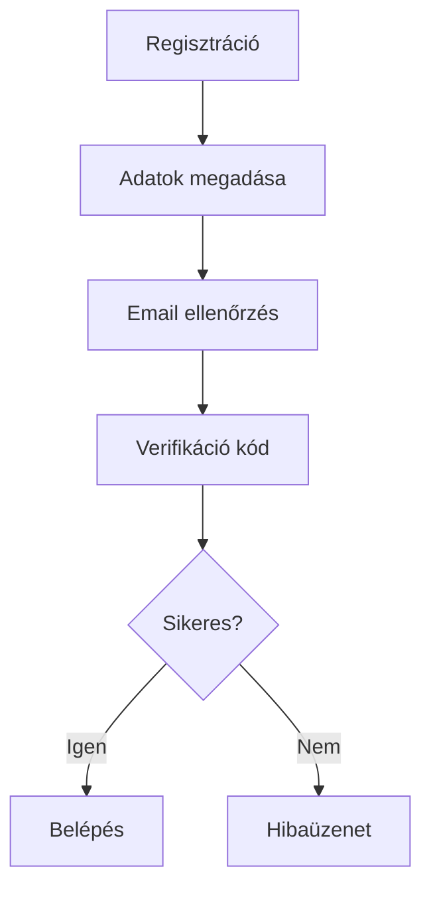
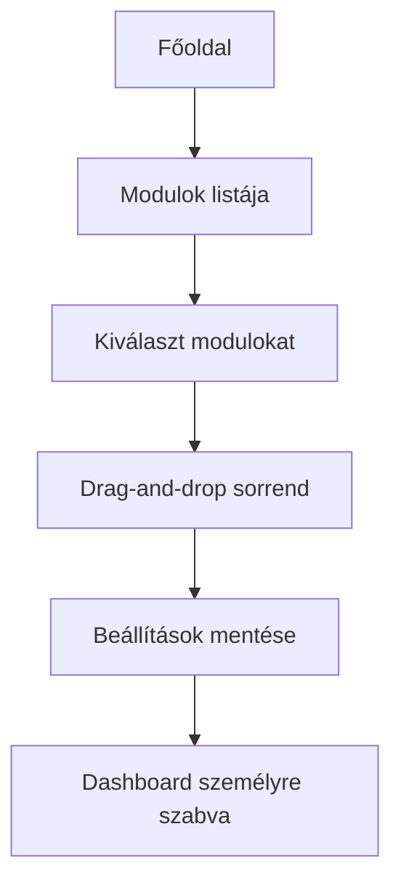
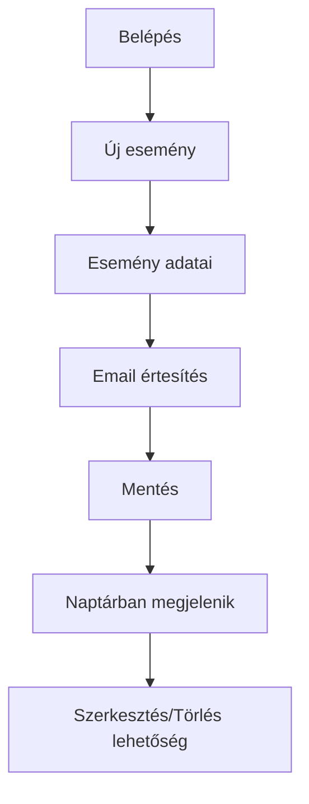

# Everything In One Website  
## Funkcionális specifikáció

**Projekt neve:** Everything In One Website  
**Készítette:** [CSK-7]  
**Dátum:** 2025-09-30

---

## 1. A rendszer céljai és nem céljai

### Célok
- Egyetlen webes alkalmazásban egyesíteni a modern mindennapi digitális funkciókat: naptár, eseményszervezés, jegyzetek, napló, időjárás, tőzsde, hírek, repülőjegy keresés, egészségkövetés, achievementek, emlékek, napi meme és ima, testreszabható főoldal, AI ajánlás, dinamikus akciógombok.
- Felhasználóbarát, reszponzív, reklámmentes, biztonságos felület.

### Nem célok
- Adminisztrációs felület, többszintű jogosultság.
- Privát üzenetküldés, saját képek feltöltése.
- Komplex pénzügyi műveletek.
- Mobil applikáció fejlesztés.

---

## 2. Jelenlegi helyzet leírása

A felhasználók széttagolt appokat/weboldalakat használnak egy-egy funkcióra (naptár, jegyzet, időjárás, egészség). Az adatok átvezetése nehézkes, az élmény reklámokkal terhelt, az integráció hiányos.

---

## 3. Vágyott rendszer leírása

Minden funkció egy fiókkal, integrált, testreszabható dashboardon, reklámmentesen, automatikusan frissülő adatokkal, AI funkciókkal, okos eszközök vezérlésével.

---

## 4. Külső megszorítások és szabványok

- GDPR, magyar adatvédelmi szabályok
- Böngésző kompatibilitás: Chrome, Firefox, Edge, Safari
- Külső API-k: időjárás, tőzsde, Skyscanner, Meme, News, Moon Phase
- Internetkapcsolat szükséges

---

## 5. Fő funkciók, modulok  
(A minden fő modulhoz, funkcióhoz **min 4 példa** – workflow, user story, valós élethelyzet, képernyő vázlat, ábra!)

---

### F1 – Bejelentkezés / Regisztráció

#### User story példák

1. **Áron, új felhasználó:**  
Regisztrál, email-jelszó páros, kap email-verifikációt, majd be tud lépni.

2. **Kata, elveszíti jelszavát:**  
Jelszóemlékeztető funkcióval visszaállítja, emailben kap linket.

3. **Pisti, duplikált e-mail:**  
Regisztrációkor hibaüzenetet kap, a rendszer nem enged több azonos emailt.

4. **Edit, első használónak készít egy fiókot családjának:**  
Regisztráció után mindenkinek elküldi a belépési adatokat, mindenki külön fiókkal dolgozik.

#### Folyamatábra



#### Képernyő vázlat
```
+-----------------------------+
| Regisztráció                |
|-----------------------------|
| E-mail:      [___________]  |
| Jelszó:      [___________]  |
| Jelszó ismét: [__________]  |
| [Regisztrálok]              |
+-----------------------------+
```

---

### F2 – Profil szerkesztése

#### User story példák

1. **Dániel, adatok frissítése:**  
Módosítja a névét, email címét, új jelszót állít be.
2. **Szilvi, elfelejti profilképének feltöltését:**  
Profilkép opcionális, nem kéri a rendszer, elmenti a profilját.
3. **Ági, kilépés:**  
Profiledit oldalon kijelentkezik, rendszer azonnal kilépteti, session törlődik.
4. **Petra, GDPR-törlést kér:**  
Kilép után személyes adatait törli, kérheti az adatainak exportját.

#### Képernyő vázlat
```
+-----------------------------+
| Profil szerkesztése         |
|-----------------------------|
| Név:     [___________]      |
| E-mail: [___________]       |
| Jelszó: [___________]       |
| Profilkép: [Válassz...]     |
| [Mentés] [Kilépés]          |
+-----------------------------+
```

---

### F3 – Dashboard testreszabás

#### User story példák

1. **Miki, minimalista:**  
Csak naptárat és health modult akar látni. Kikapcsolja a meme és tőzsde modult.

2. **Eszter, maximalista:**  
Az összes modult bekapcsolja, drag-and-droppal átrendezi az elrendezést: naptár balra, meme, health, jegyzetek, tőzsde jobbra.

3. **Tamás, sportoló:**  
Elsősorban health és naptár modult használ, testreszabható motivációs modulokat is elhelyez dashboardra.

4. **Zoli, nyugdíjas:**  
Csak az események és a napi ima jelennek meg a főoldalon.

#### Folyamatábra



---

### F4 – Naptár / Időpontkezelés

#### User story példák

1. **Géza, szakdolgozat beadás:**  
Beírja az eseményt, beállít email értesítést, rendszer előtte nap figyelmezteti.

2. **Julcsi, családi vacsora:**  
Felviszi az eseményt, megosztja családtagokkal, akik visszajelzést adnak.

3. **Sanyi, heti edzések:**  
Minden vasárnap beírja edzéseit, rendszer heti összesítőt küld.

4. **András, múltbeli visszanézés:**  
Keres 2019-es nyári eseményeket, dashboardon visszanézett minden korábbi programot.

#### Folyamatábra



#### Képernyő vázlat
```
+----------------------------------------+
| Naptár                                |
|----------------------------------------|
| Dátum:      [_____]                   |
| Név:        [_____________]            |
| Leírás:     [_____________]            |
| Idő:        [___:___]                  |
| Helyszín:   [_____________]            |
| Email értesítés [x]                    |
| [Mentés] [Mégse] [Törlés]              |
+----------------------------------------+
```

---

### F5 – Jegyzetek

#### User story példák

1. **Mari, bevásárlólista:**  
Készít egy jegyzetet "Bevásárlólista" címmel, minden vásárolni valót listáz benne, töröl, javít.

2. **Soma, meeting jegyzet:**  
Minden hétfői meetingről külön jegyzetet készít, visszakeresi az archívumból.

3. **Bence, fejlesztési ötletek:**  
Forradalmi modulötleteit menet közben írja, később visszanézi (időbélyeg alapján).

4. **Kata, titkos napló:**  
Személyes gondolatait magának jegyzi, nem osztja meg, privát jegyzetként védett a rendszerben.

#### Forgatókönyv
- Felhasználó belép -> Jegyzet modult kiválaszt -> Új jegyzet írása, cím, tartalom hozzáadása -> Mentés -> Jegyzet keresése, törlése, szerkesztése

#### Képernyő vázlat
```
+--------------------------------------+
| Jegyzetek                           |
|--------------------------------------|
| Cím:      [______________]           |
| Szöveg:   [______________]           |
| [Mentés]  [Elvetés] [Törlés]         |
+--------------------------------------+
```

---

### F6 – Napló (írásos, kérdőíves)

#### User story példák

1. **Krisztina, nap végi összegzés:**  
Minden este leírja az aznapi érzéseit, nagy eseményeket.

2. **Balázs, reggeli gyors check:**  
Bejelöl napi kérdőívet: "Hány pontban volt a nap?" "Tervek?"

3. **Judit, motivációs visszanézés:**  
Egy évvel korábbi bejegyzéseit böngészi, címkék alapján keres személyes fejlődést.

4. **Petra, programterv:**  
Előre leírja, mit szeretne teljesíteni – naptárba is beemelhető.

#### Forgatókönyv
- Belépés után napló modul kiválasztása -> Cím, dátum, szöveg írása -> Mentés -> Kérdőív kitöltése, elemzés

#### Képernyő vázlat
```
+-------------------------------------+
| Napló írása                        |
|-------------------------------------|
| Cím:   [____________]               |
| Szöveg:[____________]               |
| Kérdőív:                            |
|  [ ] Elégedett vagyok               |
|  [ ] Motivált vagyok                |
| [Mentés] [Elvetés] [Archívum]       |
+-------------------------------------+
```

---

### F7 – Egészség követés (Health)

#### User story példák

1. **Kata, sportos:**  
Minden este beírja alvás idejét, elfogyasztott vizet, lépéseit, hangulatát.

2. **Márk, kalória:**  
Napi bevitt kalóriát, makro tápanyagokat vezet, rendszer badge-et ad, ha eléri a célokat.

3. **Lilla, vízivás:**  
Csak a vízfogyasztásra koncentrál, napi visszajelzést kap, ha sikerül a terv.

4. **András, motiváció:**  
Heti összesítő e-mail: mennyit mozgott, elért célokat, megtekinti a részletes grafikonokat.

#### Forgatókönyv
- Belépés után health modul -> Adatrögzítés -> Mentés -> Grafikon, badge megjelenítés

#### Képernyő vázlat
```
+-------------------------------+
| Egészség Tracker              |
|-------------------------------|
| Alvás (óra):    [___]         |
| Víz (dl):       [___]         |
| Kalória:        [___]         |
| Hangulat:       [___/10]      |
| [Mentés] [Elemzés] [Badge-ek] |
+-------------------------------+
```

---

### F8 – Achievementek (Badge, mérföldkövek)

#### User story példák

1. **Dóra, naplózás:**  
7 egymást követő nap naplózás után "Hétről hétre" badge-et kap.

2. **Boldizsár, egészség tracker:**  
30 napos mozgás után "Mozgásmester" kitüntetést kap.

3. **Zsófi, jegyzetírás:**  
Első 10 jegyzet után "Jegyzethuszár" badge-et szerez.

4. **Imre, összesítők:**  
Statisztikáknál badge-eket nézeget, system automatikusan adja, nem lehet kérni/kikapcsolni.

---

### F9 – Időjárás

#### User story példák

1. **Éva, utazás előtt:**  
Megnézi, milyen idő lesz holnap, eldönti a ruházatot.

2. **Tomi, bringás:**  
Minden reggel a dashboardon nézi, mennyire lesz eső, a bicikliút szabad-e.

3. **Júlia, gyerekes:**  
Születésnap előtt ellenőrzi, a szabadtéri programot megtartják-e.

4. **Misi, all-in-one analitika:**  
Havi időjárás összesítőt letölt, több hónap adataival tervezi a szabadságát.

---

### F10 – Valuta/tőzsde/hírek

#### User story példák

1. **Gerda, kripto trader:**  
Naponta nézi a BTC, ETH, DOGE árfolyamot, egyszerű diagramon.

2. **Ádám, részvénypiac:**  
Google, Apple, Microsoft papírok árfolyamait figyeli, kedvencekként elmenti.

3. **Anna, gazdaság:**  
Hierarchikusan, régió szerinti híreket böngész, automatizált push notification beállítva.

4. **Teodóra, előrejelzések:**  
AI alapú statisztikákat elemzi tőzsdei trendekről.

---

### F11 – Repülőjegy keresés (Skyscanner integráció)

#### User story példák

1. **Pista, utazó:**  
Kedvenc helyét Tokióba állítja, megkapja a legjobb árakat.

2. **Martin, last minute:**  
Azonnali ajánlatokat keres hétvégére Budapest-London között.

3. **Réka, barátokkal utazik:**  
Csoportos keresés, árak összehasonlítása, több API integráció.

4. **Anett, akcióvadász:**  
Egy adott időpontra árfigyelést állít be, emailben értesítést kap az árcsökkenésről.

---

### F12 – Dinamikus háttér (holdfázis)

#### User story példák

1. **Bence, asztronómia fan:**  
Holdfázis alapján minden nap új háttérkép fogadja a dashboardon.

2. **Erika, design rajongó:**  
A háttérszín automatikusan vált, vizuális élményt jelent.

3. **Gabi, gyerekekkel tanulja a fázisokat:**  
A rendszer rövid magyarázatot is ad az aktuális fázisról.

4. **Ákos, nonstop Night Owl:**  
Csak teliholdkor aktiválja a "dark mode"-ot.

---

### F13 – Emlékek

#### User story példák

1. **Petra, nosztalgia:**  
Belépéskor látja, egy éve miket jegyzetelt, naptárba tette, motiválja a rutin fenntartására.

2. **Marci, egészségnapló:**  
Előző év futásainak statisztikáit böngészi – hasonló programokat tervez idénre.

3. **Gréta, achievement visszanézés:**  
Megtekinti, milyen mérföldkövei voltak az adott napon.

4. **Bálint, napló archívum:**  
Régebbi bejegyzéseket keres címke alapján, automatikusan felajánlja a rendszer.

---

### F14 – Napi meme

#### User story példák

1. **Zsuzsi, reggeli nevetés:**  
Belépéskor random meme jelenik meg, szebb lesz a napja.

2. **Gyuri, inspiráció:**  
Inspiráló mémek előtérbe helyezése dashboardon.

3. **Karina, megosztás:**  
A kedvenc mémeket elmenti, barátoknak továbbítja.

4. **Petra, unalom:**  
Több meme widget is lehetne elérhető egyszerre.

---

### F15 – Napi ima

#### User story példák

1. **Gábor, hívő:**  
Minden reggel megkapja a napi imát, meditációs tanácsokat.

2. **Annamária, motiváció:**  
Inspiráló ima erőt ad neki a munkahelyi kihívások előtt.

3. **Márton, családi:**  
Családi reggeli ima, dashboardon megosztva.

4. **Zita, rituálé:**  
Hosszú távon archívumból visszanézi a legszebb imákat.

---

### F16 – Modul testreszabás
1. **Lili, vizuális:**  
Tetszés szerint rendez modulsorrendet, csak a kedvenceket jeleníti meg.

2. **Robi, programozó:**  
Dashboardon elrejthető minden modul, csak egy markdown widgetet használ.

3. **Bálint, családi:**  
Gyerekei számára saját modulokat (pl. "családi naptár") testreszab.

4. **Vanda, productivity:**  
Naptár, jegyzetek, health első helyen, gyorscserélhető elrendezés.

---

### F17 – Vágólapra másolás

1. **Csaba, naptár export:**  
Események részleteit vágólapra másolja meeting előtt.

2. **Edit, egészség összegzés:**  
Health modul heti összesítőjét egy kattintással bemásolja egy emailbe.

3. **Péter, meme share:**  
Kedvenc meme irodai levelezésbe kopizva.

4. **Zsófi, repülőjegy adatok:**  
Booking infó kopizva utazástervezőbe.

---

### F18 – Hibakezelés

1. **Gergő, elgépelés:**  
Külön mező kiemeli a hibás mezőt, segítő tooltipet jelenít meg.

2. **Kata, duplikált adat:**  
Felhasználónév már létezik, egyértelmű hibaüzenetet kap.

3. **Tomi, API leáll:**  
Külső szolgáltatás hiba esetén alternatív adatforrás ajánlás.

---

### F19 – Bővíthetőség

1. **János, új eszköz integráció:**  
Smart home API-t ad hozzá, AI automatikusan felismeri és funkciókat ajánl.

2. **Laura, új modul ötlet:**  
"Sportversenyek" widgetet fejleszt, testreszabás dashboardon megjelenik.

3. **Ági, AI modul upgrade:**  
Rendszer admin új AI modelleket tölt be, prompt engineerrel finomítja az ajánlásokat.

---

### F20 – Publikus elérés

1. **Dávid, tanár:**  
Diákjai számára mindenkinek elérhető weboldalon oszt ki feladatokat.

2. **Miklós, influenszer:**  
Publikus dashboard linket készít, követői látják aktivitásait.

3. **Petra, családi szervezés:**  
Család minden tagja eléri, nincs jogosultsági limit.

---

### F21 – AI ajánló modul

1. **Kata, sportoló:**  
Minden nap az AI 2-3 programot ajánl: "Futókör a Margitszigeten!", "Próbáld ki a smoothiet!", "Nézz egy motivációs videót!"

2. **András, menedzser:**  
Naptár, meeting, jegyzet alapján az AI az adott napra hasznos podcastot, cikket ajánl.

3. **Petra, szabadidő:**  
Az AI a szabad órák alapján hobbiprogramokat javasol.

---

### F22 – Dinamikus akciógombok (AI)

1. **Misi, okos otthon:**  
Hőmérséklet kártyán "Fűtés bekapcsolása" gomb – API hívás saját rendszerhez.

2. **Gerda, reggeli rutin:**  
Kávéfőző elindítása automatikusan gombbal, AI a naptár reggeli időpontján ajánlja fel.

3. **Anna, hírmegosztás:**  
"Elküldés barátoknak" gomb, AI a fontos hírek vagy mémek alatt javasolja.

4. **Tomi, automata feladatok:**  
Minden kártyán a tartalomhoz igazodó művelet/gomb (pl. sport: "Lépésszámláló indítása").

---

### F23 – Külső API integráció

1. **Márta, okos termosztát:**  
API kulcs hozzáadása, AI automatikusan kártyán megjeleníti vezérlési lehetőtéseket.

2. **Endre, időjárás API:**  
Város kiválasztása, helyek összehasonlítása, API válaszok alapján AI ajánlás a programokra.

3. **Betti, meme API:**  
Több API kulcs, AI dönt hogy melyik forrásból hozza a napi meme-t.

---

## 6. Forgatókönyvek  
(Több felhasználói példa, mindennapi folyamatok végigvezetése, komplex workflow: reggeli rutin, eseményszervezés, motivációs nap, AI ajánlások, smart home vezérlés.)

---

## 7. Fogalomtár

| Fogalom        | Leírás                                              |
|----------------|-----------------------------------------------------|
| Dashboard      | Főoldal, modulokat tartalmazó áttekintő képernyő    |
| Achievement    | Mérföldkövek, statisztika, badge-ek                 |
| Widget         | Testreszabható modul a dashboardon                  |
| API            | Külső adatforrás                                    |
| Health         | Egészségadatok (pl. alvás, kalória, mozgás)         |
| Memories       | Automatikusan megjelenő napi emlékek                |
| AI ajánló      | Naptár, aktivitás, jegyzet alapján ajánlásokat generál |
| Dinamikus gomb | AI által generált releváns művelet dashboard kártyán |

---

## 8. Képernyőtervek  
(ASCII, ábrák, mermaid diagramok, minden fő modulhoz!)

---

## 9. Külső API integráció

- Időjárás, tőzsde, repülőjegy, meme, hírek, moon phase, okos otthon, stb.
- Új API kulcsok, prompt engineer támogatás AI funkciókhoz.

---
