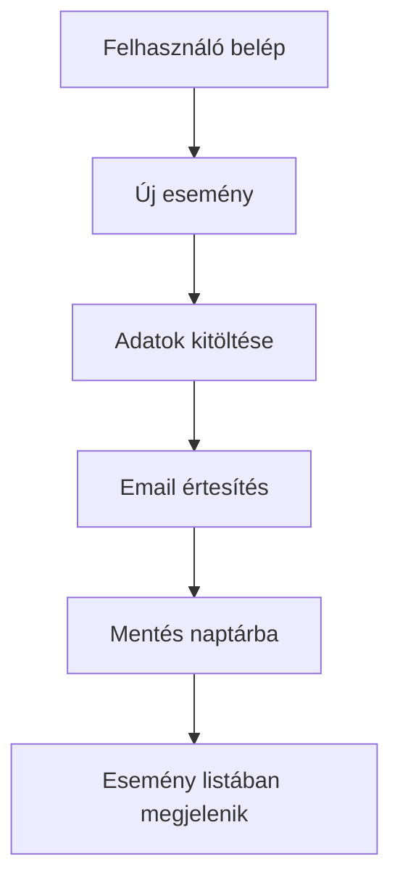
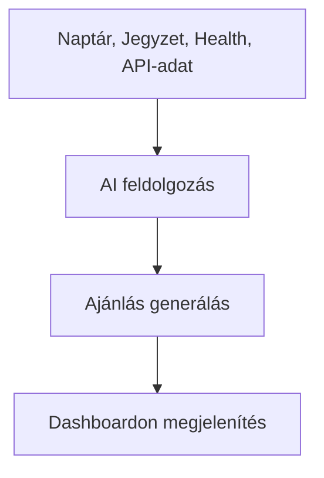
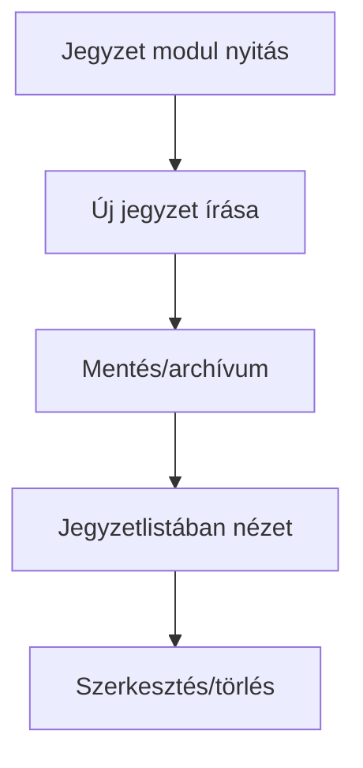
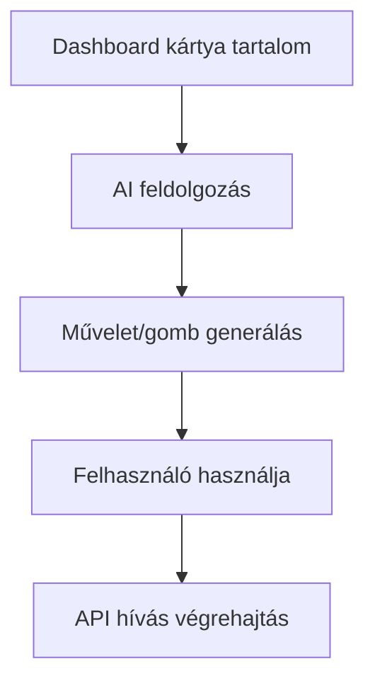

# Szoftver Követelményspecifikáció  
**Projekt neve:** Everything In One Website  
**Készítette:** CSK-7  
**Dátum:** 2025-09-30

---

## 1. Áttekintés

Az Everything In One Website böngészőalapú webalkalmazás, amely egyesíti a digitális hétköznapi funkciókat: naptár, eseményszervező, jegyzet, napló, egészség, időjárás, tőzsde, hírek, repülőjegy keresés, achievementek, emlékek, meme, ima, AI ajánlások, dinamikus akciógombok.

---

## 2. Fő üzleti célok

- Minden funkció egy fiók alatt, egységes dashboard.
- Külső API-k integrálhatósága: időjárás, tőzsde, repülőjegy, meme, hírek.
- Személyre szabott AI ajánlások, dinamikus gombok.
- Adatmentés, visszanézés, testreszabható modulok.
- GDPR, magyar adatvédelmi szabályok.

---

## 3. Funkcionális követelmények  
Az alábbiakban minden modulhoz részletes, sok példás kifejtés található.

---

| Modul/Funkció            | ID   | Név                       | V.  | Kifejtés                                                                                              |
|--------------------------|------|---------------------------|-----|-------------------------------------------------------------------------------------------------------|
| Rendszer                 | F0 | Böngésző alapú működés    | 0.1 | Modern böngészőben telepítés nélkül, reklámmentesen működik.      
| Felhasználói fiók        | F1   | Bejelentkezés/Regisztráció| 0.1 | Felhasználói fiók létrehozása, bejelentkezés, jelszókezelés.                                          |
| Felhasználói profil      | F2   | Profil szerkesztés        | 0.2 | Felhasználó szerkesztheti profil adatait (név, email, jelszó). Profilkép nem szükséges.               |
| Főoldal                  | F3   | Dashboard                 | 0.2 | Belépés után főoldal, ahol az összes fő funkció elérhető. A felhasználó kiválaszthatja, mit lát rajta.|
| Naptár                   | F4   | Naptár és eseményszervező | 0.3 | Események létrehozása, szerkesztése, törlése, email értesítés az eseményekről, naptárnézet.           |
| Jegyzetek                | F5   | Jegyzetek                 | 0.3 | Saját jegyzetek írása, szerkesztése, törlése, keresése. Megosztás nem szükséges.                      |
| Napló                    | F6   | Napló (írásos, kérdőíves) | 0.3 | Személyes napló írása, nap végi kérdések kitöltése, csak saját részre, visszanézhető.                 |
| Health                   | F7   | Egészség követés          | 0.4 | Alvás mennyiség/minőség, bevitt kalória, ivott víz, mozgás, hangulat rögzítése, visszanézése.         |
| Achievementek            | F8   | Automatikus achievementek | 0.4 | Automatikusan elérhető célok, mérföldkövek, badge-ek a használat/kitöltés alapján.                    |
| Időjárás                 | F9   | Időjárás megtekintés      | 0.4 | Aktuális/előrejelzett időjárás lokáció alapján (API-ból, pl. OpenWeatherMap), főoldalon is megjelenhet|
| Valuta/tőzsde            | F10  | Valuta, tőzsde, hírek     | 0.5 | Valutaárfolyamok, részvények, kripto, általános hírek API-ból. Felhasználó kiválaszthatja kedvenceit. |
| Repülőjegy               | F11  | Repülőjegy keresés        | 0.5 | Skyscanner API-val keresés, felhasználó beállíthat kedvenc helyet, amit a funkcióban használhat.      |
| Háttér                   | F12  | Holdfázis háttér          | 0.6 | Háttérkép automatikus változása holdfázis szerint (Moon Phase API).                                   |
| Memories                 | F13  | Emlékek                   | 0.7 | Napi emlékek (pl. 1 éve ezen a napon rögzített napló/jegyzet/health adat), belépéskor megjelenítve.  |
| Napi meme                | F14  | Napi meme                 | 0.7 | Minden belépéskor megjelenik egy véletlen meme egy API-ból (pl. Meme API vagy Reddit API).            |
| Napi ima                 | F15  | Napi ima                  | 0.7 | Minden belépéskor megjelenik egy napi ima (API vagy előre feltöltött adat).                           |
| Testreszabás             | F16  | Főoldal testreszabása     | 0.8 | Felhasználó beállíthatja, mely modulokat szeretné látni a dashboardon, sorrendet is módosíthatja.     |
| Felhasználói élmény      | F17  | Vágólapra másolás         | 0.8 | Minden fő adat (esemény, jegyzet, napló, valuta, stb.) eredménye egy kattintással vágólapra másolható.|                                    |
| Rendszer                 | F18  | Hibakezelés               | 1.0 | Érvénytelen bemenet esetén figyelmeztető üzenet jelenik meg.                                          |
| Rendszer                 | F19  | Bővíthetőség              | 1.0 | Új modulok/funkciók könnyen hozzáadhatók a rendszerhez.                                               |
| Publikum                 | F20  | Publikus elérés           | 1.0 | Az alkalmazás bárki számára elérhető, nincs hozzáférési korlátozás.                                   |

---

### F0 – Böngésző alapú működés

- Telepítés nélkül, minden modern böngészőben fut (Chrome, Firefox, Safari, Edge).
- Reszponzív design, mobil/tablet/desktop támogatás.

**Példák:**  
- Petra iPad-en, Bence iPhone-on, Tamás Windows laptopon használja a webappot, mind nekik tökéletesen jelennek meg a fő funkciók.
- Kata Google Chrome-ban, Dániel Mozilla Firefox-ban dolgozik; minden funkció ugyanúgy működik.
- Ági az egyetemi könyvtár számítógépén is eléri a platformot telepítés nélkül.

---

### F1 – Felhasználói fiók, regisztráció, bejelentkezés

- Email + jelszó páros, jelszóemlékeztető e-maillel, regisztrációkor email-verifikáció.
- Jelszó hash, biztonságos bejelentkezés (JWT, session).

**Példák:**  
- Áron regisztrál, megadja emailjét, kap verifikációs kódot, belép.
- Gábornak elromlik a jelszava, jelszóemlékeztetővel emailben reseteli.
- Eszter duplán próbál regisztrálni, hibaüzenetet kap, nem lehet azonos emailt kétszer használni.
- Kata regisztráció után rögtön saját személyes dashboardot lát, egy kattintással bejelentkezik következő alkalommal.

---

### F2 – Profil szerkesztés

- Név, email cím, jelszó módosítható, profilkép (opcionális).
- Profiloldalon GDPR export/adattörlés opció.

**Példák:**  
- Szilvi módosítja e-mailjét új címére.
- Olivér elfelejti jelszavát, új jelszót állít be profiloldalon.
- Edit külön kérelmezi adatai törlését, a rendszer teljesen eltávolítja.
- Petra profilkép nélkül is el tudja menteni profilját.

---

### F3 – Dashboard testreszabás

- Modulok sorrendje, kikapcsolása, drag-and-drop, egyedi elrendezés.

**Példák:**  
- Bálint csak a naptárat és a meme modult hagyja meg a dashboardon.
- János minden modult bekapcsol, elrendezést drag-and-droppal átszerkeszti.
- Kata a productivity widgeteket teszi előre, motivációs modulok hátra.
- Dóra egészség és achievementek modult szeretné csak, minden mást kikapcsol.

---

### F4 – Naptár/Eseményszervező

- Új esemény létrehozása, szerkesztése, törlése.
- Esemény naptárnézetben: havi, heti, napi.
- Email értesítés, megosztás, visszaigazolás, múltbeli esemény keresés.

**Példák:**  
- Géza beadandó időpontot létrehoz, előtte nap emailt kap.
- Julcsi családi vacsorát szervez, meghívja családtagokat, visszajelzést kap.
- Sanyi hetente minden edzését beírja, összesítő emailt kap.
- András visszanézi 2019-es programokat, archiválva látja őket.

---

### F5 – Jegyzetek

- Jegyzet létrehozás, szerkesztés, törlés, privát és publikálható jegyzetek.

**Példák:**  
- Mari saját bevásárlólistát vezet, törölget, módosít.
- Soma munkanap külön jegyzeten vezeti meetingeket, visszakeresi az archívumból.
- Bence minden modulötletét folyamatosan jegyzeteli.
- Kata naplót ír magának, privát jegyzet módba rakja.

---

### F6 – Napló (írásos, kérdőíves)

- Bejegyzés írása, kérdések kitöltése, visszanézhető napló.

**Példák:**  
- Krisztina minden este leírja az aznapi érzéseit.
- Tamás reggeli tervezéshez kitölti a kérdőívet.
- Judit motivációs sorokat ír és év elején visszakeresi.
- Petra speciális programtervet ír, amiből akár naptáresemény is lehet.

---

### F7 – Egészség követés

- Adatok: alvás, mozgás, kalória, víz, hangulat. Automatikus badge, grafikon.

**Példák:**  
- Kata minden este egészségadatokat tölt fel, badge-et kap a kitartásért.
- Márk napi kalória/bevitelét vezetné, a rendszer segít.
- Lilla napi vízbevitelét figyeli, visszajelző hangulatpontot kap siker esetén.
- András heti statisztikákat és badge-eket nézet meg.

---

### F8 – Achievementek

- Automatikusan generált célok, mérföldkő, badge.

**Példák:**  
- Dóra 7 napos napló badge-et kap.
- Boldizsár 30 napos mozgás után “Mozgásmester” lett.
- Zsófi 10 jegyzet után “Jegyzethuszár” kitüntetést kap.
- Imre a statisztika részben nézi, melyik badge-et teljesítette.

---

### F9 – Időjárás

- Előrejelzés, helyzethez kötött, API-ból frissül, statisztika.

**Példák:**  
- Éva megnézi, milyen idő lesz holnap, eldönti a ruházatot.
- Tamás biciklizés előtt ellenőrzi, lesz-e eső.
- Júlia születésnapi program előtt nézi, kinti buli lehetséges-e.
- Misi havi időjárás-analízist néz, szabadságot tervez ennek alapján.

---

### F10 – Valuta/tőzsde/hírek

- Kripto, részvény, hírek, automatikus értesítések, kedvencek.

**Példák:**  
- Gerda minden nap nézi a kripto árfolyamokat.
- Ádám a részvényekhez grafikonokat készít.
- Anna régiónként olvas híreket, push notification is van.
- Teodóra AI statisztikákat vizsgál a tőzsde modulban.

---

### F11 – Repülőjegy kereső

- Repülőjegy keresés, favorit városok, árfigyelés, Skyscanner API.

**Példák:**  
- Pista Tokióba keres, dashboardon rögtön látja az akciókat.
- Martin last minute szervezést tervez, London ajánlatai egy kattintásra.
- Réka csoportos keresést indít barátaival.
- Anett konkrét dátumra árfigyelést kér, emailben értesítést kap.

---

### F12 – Dinamikus háttér (holdfázis)

- Holdfázis API alapján dashboard háttér automatikusan változik.

**Példák:**  
- Bence holdfázis napi váltást követ dashboardon.
- Erika a színdinamikát is megváltoztatja design-ban.
- Gabi és gyerekei tanulják, milyen a telihold, dashboard magyarázattal.
- Ákos csak teliholdkor kapcsolja be dark mode-ot.

---

### F13 – Emlékek

- Napi emlékek, régi jegyzetek, naptáresemények, achievementek visszanézése.

**Példák:**  
- Petra nosztalgiázik, látja tavalyi bejegyzéseit dashboardon.
- Marci egészségnapló statisztikákat tölti le régi futásairól.
- Gréta achievementjeit nézi – például "1 éve teljesített célok".
- Bálint címke alapján keres a napló archívumban.

---

### F14 – Napi meme

- Random meme API, napi motiváció vagy nevetés.

**Példák:**  
- Zsuzsi reggeli meme-t néz, jobb kedvre derül.
- Gyuri inspiráló mémeket keres, dashboardon előtérbe állítja.
- Karina kedvenc mémeket archivál, barátainak küldi.
- Petra több meme widgetet von be, reggel, este, szünetben különböző.

---

### F15 – Napi ima

- Napi ima, meditációs tanácsok, archívum, családi megosztás.

**Példák:**  
- Gábor minden reggel imát olvas, meditációval összekapcsolva.
- Annamária munkavállalói inspirációt kap akár imákból.
- Márton családi imát indít reggelente.
- Zita az archívumból legszebb imákat válogat.

---

### F16 – Modul testreszabás

- Bármely modul, widget, sorrend, elrendezés, kikapcsolható, csoportosítható.

**Példák:**  
- Lili testreszabja modulokat, csak a kedvenceket tartja meg.
- Robi markdown widgetet fejleszt, minden mást elrejt.
- Bálint családi dashboardot készít.
- Vanda productivity első helyen rakja a fő funkciókat.

---

### F17 – Vágólapra másolás

- Eredmény, esemény, jegyzet, health adat egy kattintással vágólapra.

**Példák:**  
- Csaba meeting előtt a naptárból másolja az összefoglalót.
- Edit egészség összesítőt emailbe másolja.
- Péter meme-t kopiz irodai chatbe.
- Zsófi repülőjegy infót exportál utazástervezőbe.

---

### F18 – Hibakezelés

- Minden hibára észrevehető, támogató üzenet, offline/online error log, tippek.

**Példák:**  
- Gergő elgépel valamit, piros keretet kap a hibás mező.
- Kata duplikált felhasználónév miatt pop-up hibaüzenetet kap.
- Tomi API-leállásnál a rendszer alternatív adatforrást ajánl.
- Laura hibás adatok mentésekor visszaállítási opciót kap.

---

### F19 – Bővíthetőség

- Új modul, API, funkció könnyen hozzáadható, admin oldalról menedzselhető.

**Példák:**  
- János új okosotthon API-t integrál ("SmartAC"), AI kártyán azonnal megjelenik műveletgomb.
- Laura "Sportversenyek" widgetet fejleszt, elérhető a dashboardon.
- Ági AI modell upgrade-et kér adminisztrációval, prompt engineer finomhangolással.
- Kristóf új repjegy kereső API-t épít be, nem kell nagy fejlesztés.

---

### F20 – Publikus elérés

- Bárki számára elérhető, nincs jogosultsági limit, direktlink, családi/csoportos dashboard, vendégmód.

**Példák:**  
- Dávid tanárként diákjainak publikus dashboardot nyit a tananyaghoz.
- Miklós influenszerként követői számára betekintést enged a napi rutinjába.
- Petra családjának közös dashboardot készít, mindenki online látja.
- Edit csak a publikus részhez enged hozzáférést barátainak.

---

### F21 – AI ajánlórendszer

- Dashboardon automatikusan, naptárból, jegyzetekből, egészségadatokból, aktivitásból generált, személyre szabott napi/órás/tematikus ajánlások.

**Példák:**  
- Kata sportoló, naponta AI “Futókör a Margitszigeten!”, “Smoothie recept”, “Motivációs videó” ajánlást kap.
- András menedzserként meeting, jegyzet és naptár alapján podcastot, cikket, könyvet kap.
- Petra szabadidő alapján hobbiprogramot ajánl a rendszer (pl. “Keress egy új éttermet!”, “Rejtvényt tölts ki!”).
- Viktor hangulat-adatok alapján mindig valami pozitív/aktivitásra ösztönző programot kap.

---

### F22 – AI dinamikus gombok

- Kártyákon AI által generált műveletgomb: átirányítás (infó, cikk), API-hívás (smart home, kávéfőző, hőmérséklet, megosztás), minden user aktuális, személyre szabott élethelyzete alapján.

**Példák:**  
- Misi okosotthon: hőmérséklet kártyán “Fűtés bekapcsolása” API-gomb.
- Gerda reggeli időpontban “Kávéfőző elindítása” gomb jelenik meg.
- Anna fontos híre alatt “Küldés barátoknak” gomb, az AI tudja, hogy ki lehet releváns.
- Tomi sport statisztikán “Lépésszámláló indítása” gomb, AI aktivitásból ajánlja.

---

### F23 – Külső API integráció

- Felhasználói beállításokkal új API-k hozzáadása, kulcsokkal, prompt engineeringgel, AI beépítve.

**Példák:**  
- Márta termosztát API-t köt be, AI automatikusan műveletgombot ajánl dashboardon.
- Endre időjárás API-városokat integrál, összehasonlít, AI programajánlást generál.
- Betti több meme API-t rögzít, AI dönt, melyikből hozza napi offer-t.
- Kristóf okosotthon eszközt API-val, és a rendszer automatikusan felismeri a funkciókat.

---

## 4. Nem funkcionális követelmények

- Biztonság, GDPR, magyar adatvédelem.
- Skálázhatóság, gyors válaszidő.
- Karbantartás, dokumentáltság, teszt automatizáció.
- Reszponzivitás, akadálymentesség.
- Automatikus API-adatfrissítés, AI modell update.
- Felhasználói útmutató, fejlesztői dokumentáció, Swagger.

---

## 5. Függőségek, korlátozások

- Külső API-k működésétől, internetkapcsolattól függ.
- AI funkciók prompt engineeringel bővíthetők, adminisztrálhatók.

---

## 6. Ábrák, screenek, példák (minden fő modulhoz):

#### Naptár modul  

#### AI ajánló modul  

#### Jegyzetek  

#### Okos otthon gomb  

---

## 7. Használati példák (összefoglaló)

- Reggeli rutin: Belépés, AI ajánlás, időjárás, meme, health adatrögzítés, motiváció, napi program.
- Eseményszervezés: Új naptáresemény, meghívás, jegyzetek, email értesítés, családi visszaigazolás.
- AI okos gomb: "Indítsd el a kávéfőzőt!" reggel egy kattintással; "Küldd el a heti statisztikát".
- Motivációs nap: Napi meme, achievement badge, hangulat-jegyzet, egészség összesítő megtekintése.
- Okos otthon vezérlés: Dashboardról API-hívással telepített eszközök vezérlése.

---
